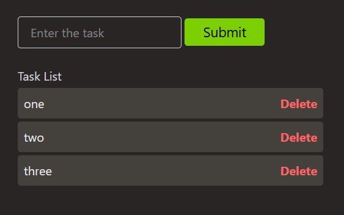
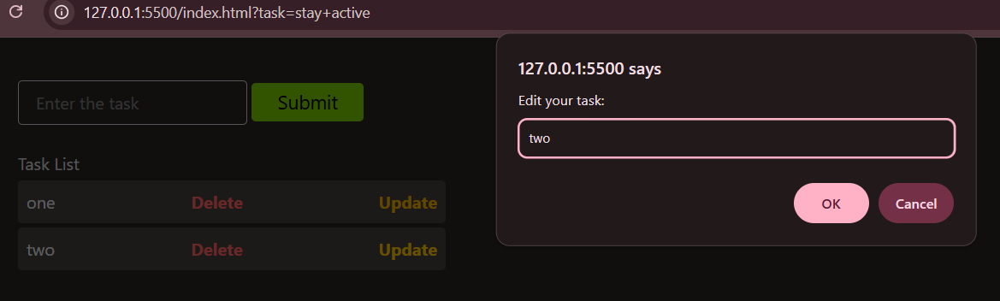

# CRUD (Vanilla JavaScript)

## 📝 To-Do List App 

A simple, elegant, and responsive **To-Do List Application** built using **HTML**, **Tailwind CSS**, and **Vanilla JavaScript**.  
This app allows you to **add**, **update**, and **delete** tasks effortlessly — all within a clean, minimal UI.

---

## 🚀 Features

✅ **Add Tasks** — Enter any task and instantly add it to your task list.  
✏️ **Update Tasks** — Edit existing tasks using an update button.  
🗑️ **Delete Tasks** — Remove any task easily with a delete button.  
💾 **(Optional)** — Can be extended to store tasks in `localStorage` for persistence.  
🎨 **Responsive UI** — Built with Tailwind CSS for a modern look and mobile-friendly layout.  
⚡ **No Frameworks Needed** — 100% Vanilla JavaScript.

---

## 🧩 Tech Stack

- **HTML5**
- **Tailwind CSS**
- **Vanilla JavaScript (ES6)**

---
## 📸 Preview





(Add a screenshot or GIF here)
Example:

## 💻 Installation & Setup

## 🧠 How It Works

- Enter a task in the input field.

- Click Submit to add it to the list.

- Click Update to edit the task.

- Click Delete to remove it.

### All interactions happen dynamically without reloading the page.

1. **Clone this repository:**
   ```bash
   git clone https://github.com/your-username/todo-app.git
